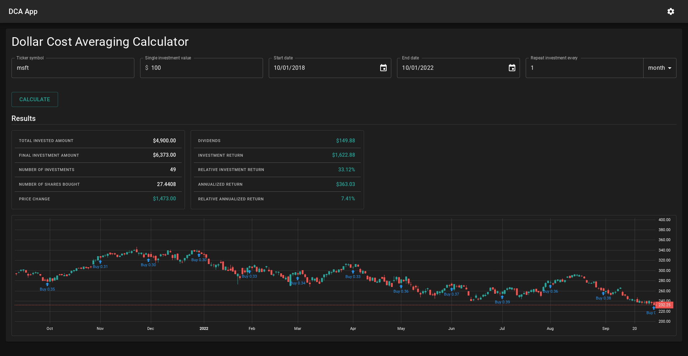

# Dollar Cost Averaging App



## Demo ([dcaapp.net](https://dcaapp.net))

Demo available on the [dcaapp.net](https://dcaapp.net) website

## Requirements:

- [Docker Desktop](https://docs.docker.com/get-docker/)

## Build the app

```bash
docker compose build
```

## Run the app

```bash
docker compose up
```

## Run Frontend Tests

Go to `frontend/` dir:

```bash
cd frontend/
```

### Unit tests

Run unit tests:

```bash
npm run test
```

Get the test coverage:

```bash
npm run coverage
```

### End-to-end tests

```bash
npm run cypress:open
```

# Production

### Build

To build frontend app run from root dir:

```bash
docker compose -f docker-compose.yml run --rm frontend npm run build
```

Build docker contaners:

```bash
docker compose -f docker-compose.prod.yml build
```

### Run the app

```bash
docker compose -f docker-compose.prod.yml up
```

## Load data to the database

Connect to db container:

```bash
docker exec -it dca_db mongosh -u <user_name> -p <password>
```
